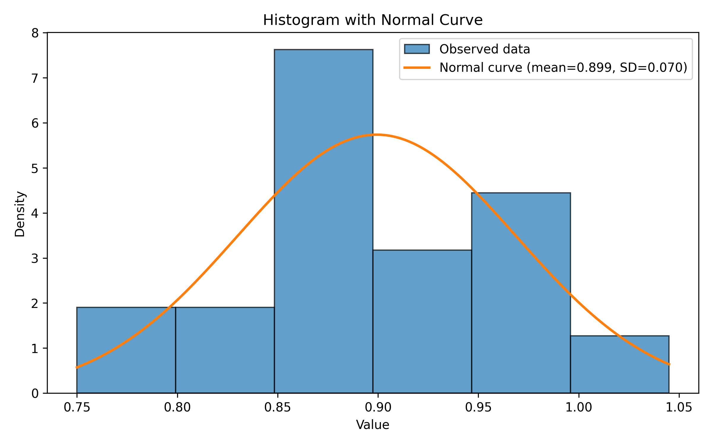
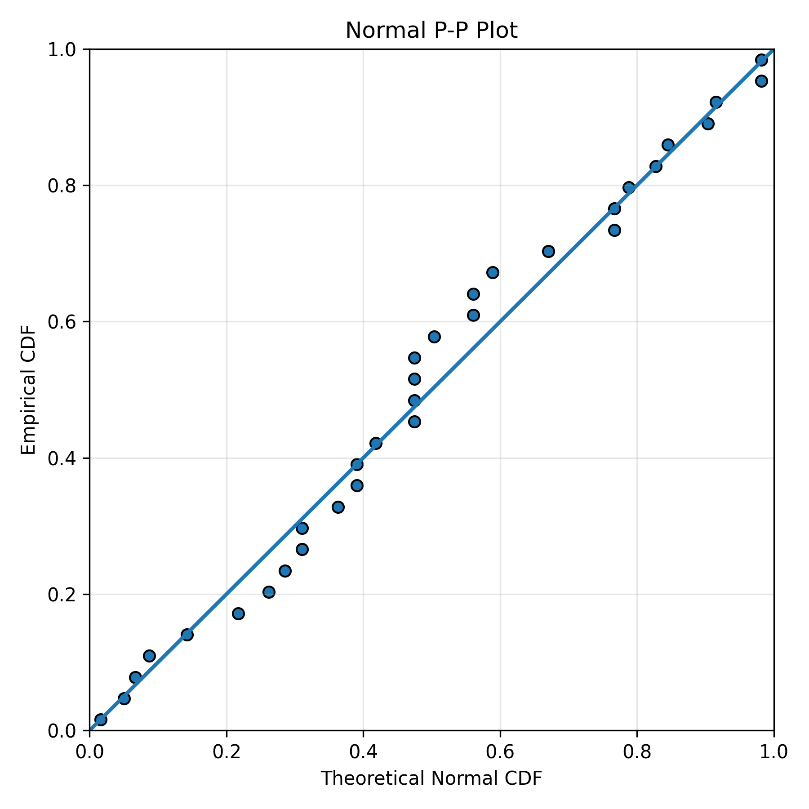
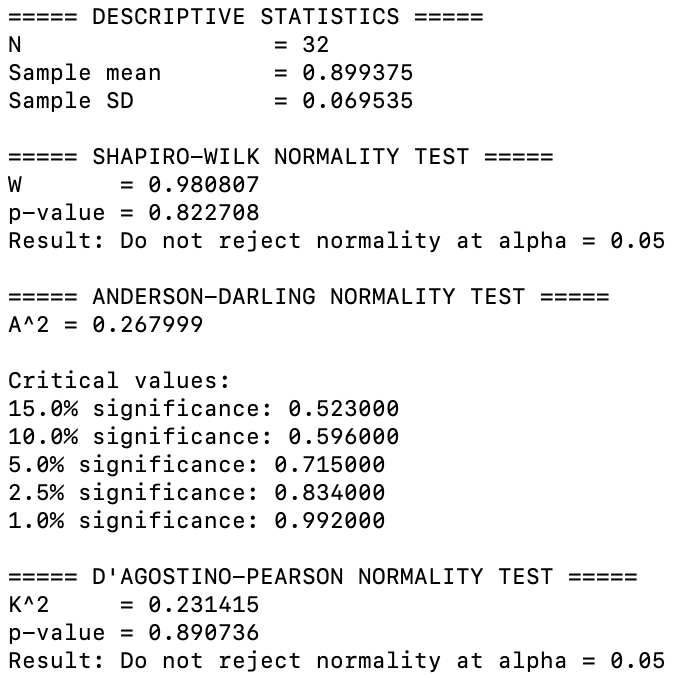

## EE503 HW4 Report
Dongran Lin

Data source: Weight printed on label of Salmon Fillets at Trader Joe's.

Tests performed: Shapiro-Wilk, Anderson-Darling, and D'Agostino-Pearson.

Disclosure: Python script generated by ChatGPT. 

Despite passing normality tests, certain SKU with different decimal accuracy tend weight more for containing 2 smaller fillets instead of 1 fillet, thus the cutting process may be different and those data are excluded from this report, only in appendix for reference.
 

  
  

Appendices at: github.com/eorof/ee503_hw4